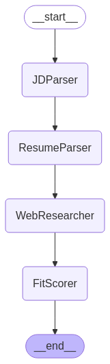

# AI Recruiting Assistant

A LangGraph-powered recruiting assistant that analyzes job descriptions and candidate resumes, performs web research, and provides fit assessments. Includes a modular FastAPI backend and CLI for flexible usage.

---

## Recruiter AI Agent Graph

The recruiter agent's workflow is orchestrated as a graph of nodes, each responsible for a step in the candidate-job matching process. The diagram below illustrates how nodes interact:



---

## How the Recruiter AI Agent Works

The recruiter agent follows these steps:

1. **JDParser**: Analyzes the job description, extracting structured requirements, responsibilities, and skills.
2. **ResumeParser**: Parses the candidate's resume to extract education, experience, and skills.
3. **WebResearcher**: Searches the web for additional candidate information (e.g., GitHub, blogs, talks).
4. **FitScorer**: Compares the candidate's profile with the job requirements and generates a detailed fit assessment, including a score and reasoning.

Each node is implemented as a function and orchestrated using LangGraph, allowing for extensible and transparent workflows.

---

## API Endpoints (FastAPI)

The backend exposes the following endpoints (see `api/agent.py`):

### `POST /run-agent/`
Run the recruiter agent on a candidate and job description.

**Request:** `multipart/form-data`
- `candidate_name`: string
- `resume`: file (PDF, DOCX, or TXT)
- `job_description`: file (PDF, DOCX, or TXT)

**Example cURL:**
```bash
curl -X POST "http://localhost:8001/run-agent/" \
  -F "candidate_name=Sumit Chauhan" \
  -F "resume=@tmp/resume.pdf" \
  -F "job_description=@tmp/job_description.txt"
```

**Response:**
```json
{
  "fit_score": "Moderate Fit",
  "score_details": { ... },
  "comparison_matrix": [ ... ],
  "reasoning": "..."
}
```

### `GET /runs/?limit=N`
Fetch the latest N recruiter agent runs from the database (default: 10, max: 100).

**Example cURL:**
```bash
curl "http://localhost:8001/runs/?limit=5"
```

**Response:**
```json
[
  {
    "timestamp": "2025-05-08T00:12:58.123Z",
    "input": { ... },
    "output": { ... }
  },
  ...
]
```

---

## Command Line Interface

You can also run the recruiter agent from the command line:

```bash
python -m recruiter_agent.graph --candidate-name "Sumit Chauhan" --resume tmp/resume.pdf --job-description tmp/job_description.txt
```

---

## Architecture

The application uses LangGraph to orchestrate the following components:

1. **JDParser**: Analyzes job descriptions and extracts structured data
2. **ResumeParser**: Parses candidate resumes into structured data
3. **WebResearcher**: Searches the web for additional candidate information
4. **FitScorer**: Evaluates candidate fit against job requirements

## Setup

### Prerequisites

- Python 3.9+
- Required packages (see `requirements.txt`)
- API keys:
  - Anthropic API key (for Claude)
  - Tavily API key (for web search)

### Installation

1. Clone the repository:

   ```bash
   git clone https://github.com/yourusername/ai-recruiting-assistant.git
   cd ai-recruiting-assistant
   ```

2. Create a virtual environment:

   ```bash
   python -m venv venv
   source venv/bin/activate  # On Windows, use: venv\Scripts\activate
   ```

3. Install dependencies:

   ```bash
   pip install -r requirements.txt
   ```

4. Create a `.env` file with the required API keys:
   ```
   ANTHROPIC_API_KEY=your_anthropic_api_key_here
   TAVILY_SEARCH_API_KEY=your_tavily_api_key_here
   ```

## Usage

### Command Line Interface

The application can be run from the command line:

```bash
python main.py --candidate-name "John Smith" --resume path/to/resume.pdf --job-description path/to/job_description.docx
```

Parameters:

- `--candidate-name`: Name of the candidate (optional, will be extracted from resume if possible)
- `--resume`: Path to the resume file (PDF, DOCX, or TXT)
- `--job-description`: Path to the job description file (PDF, DOCX, or TXT) or text content
- `--output`: Output file path (default: assessment.md)

### Example

```bash
python main.py --candidate-name "Jane Doe" --resume examples/resume.pdf --job-description examples/job_description.docx --output assessment_jane_doe.md
```

## Output

The application generates two files:

1. A Markdown file with the formatted assessment (default: `assessment.md`)
2. A JSON file with the complete structured results (default: `assessment_full.json`)

## Project Structure

```
ai-recruiting-assistant/
├── main.py                  # Entry point for the application
├── config.py                # Configuration settings
├── requirements.txt         # Required packages
├── .env                     # Environment variables (API keys)
├── tmp/                     # Temporary files
├── output/                  # Output directory
└── recruiter_agent/         # Core agent modules
    ├── graph.py             # LangGraph workflow definition
    ├── llm.py               # LLM configuration
    └── pydantic_types.py    # Data models for structured output
```

## Requirements

See `requirements.txt` for the full list of dependencies. The main packages include:

- langgraph
- langchain
- langchain-anthropic
- langchain-tavily
- pydantic
- python-dotenv
- pypdf
- python-docx
- requests
- beautifulsoup4

## Development

To modify or extend the assistant:

1. Update the Pydantic models in `pydantic_types.py` to change the data structures
2. Modify the node functions in `graph.py` to alter the processing steps
3. Adjust the prompts in each node to refine the LLM instructions

## License

[MIT License](LICENSE)
