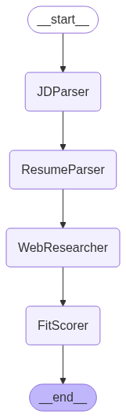
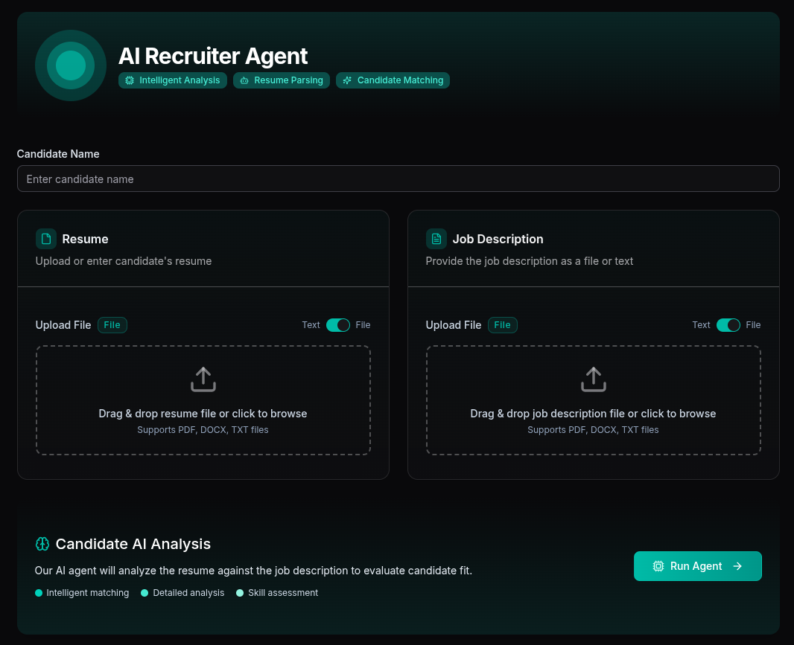
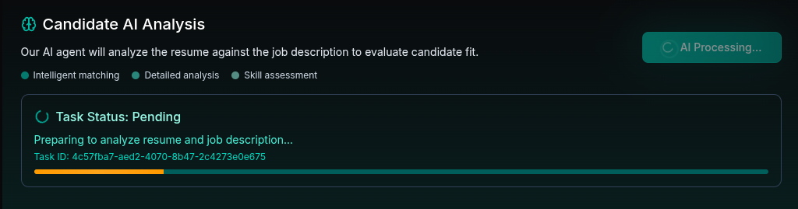
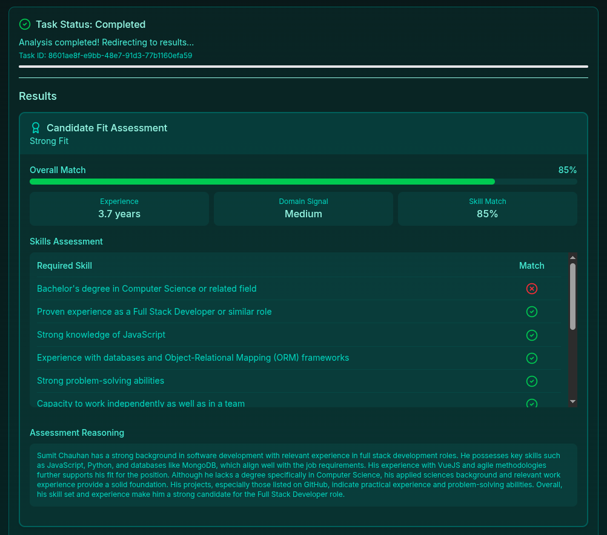
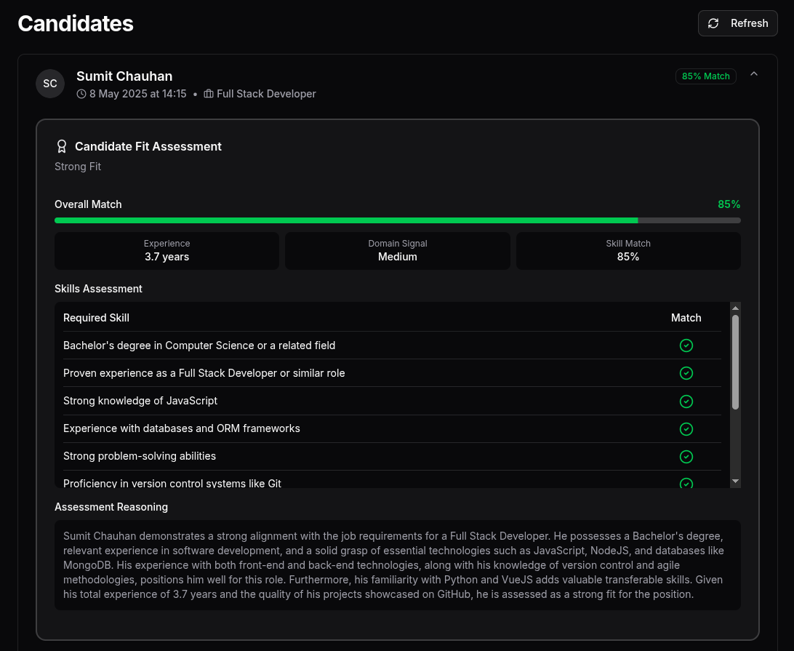

# AI Recruiting Assistant

A modern recruiting assistant that analyzes job descriptions and candidate resumes, providing detailed fit assessments with background task processing. Features a FastAPI backend and React frontend with real-time task status updates.

[Live Demo](https://recruiter.sleebit.com)



---

## Features

- **Resume & Job Description Analysis**: Upload files or paste text directly
- **Background Task Processing**: Long-running tasks are processed asynchronously
- **Real-time Status Updates**: Track analysis progress with live updates
- **Comprehensive Fit Assessment**: Detailed skill matching with visual indicators
- **Candidate Management**: View and compare all analyzed candidates

---

## UI Screenshots

### Candidate Analysis Form


### Fit Assessment Results



### Candidates List


---

## API Endpoints (FastAPI)

The backend exposes the following endpoints:

### `POST /run-agent/`
Run the recruiter agent as a background task.

**Request:** `multipart/form-data`
- `candidate_name`: string
- `resume`: file upload (PDF, DOCX, or TXT) OR
- `resume_text`: string (plain text)
- `job_description`: file upload (PDF, DOCX, or TXT) OR
- `job_description_text`: string (plain text)

**Response:**
```json
{
  "task_id": "f8e7d6c5-b4a3-2c1d-0e9f-8a7b6c5d4e3f",
  "status": "pending"
}
```

### `GET /task/{task_id}`
Check the status of a background task.

**Response (pending/running):**
```json
{
  "task_id": "f8e7d6c5-b4a3-2c1d-0e9f-8a7b6c5d4e3f",
  "status": "running",
  "created_at": "2025-05-08T10:15:30.123Z",
  "updated_at": "2025-05-08T10:15:35.456Z"
}
```

**Response (completed):**
```json
{
  "task_id": "f8e7d6c5-b4a3-2c1d-0e9f-8a7b6c5d4e3f",
  "status": "completed",
  "created_at": "2025-05-08T10:15:30.123Z",
  "updated_at": "2025-05-08T10:16:45.789Z",
  "result": {
    "resume_structured": { ... },
    "jd_structured": { ... },
    "fit_assessment": {
      "fit_score": "Moderate Fit",
      "score_details": { ... },
      "comparison_matrix": [ ... ],
      "strengths": [ ... ],
      "gaps": [ ... ],
      "reasoning": "..."
    }
  },
  "agent_run_id": "a1b2c3d4-e5f6-7g8h-9i0j-k1l2m3n4o5p6"
}
```

### `GET /runs/?limit=N`
Fetch the latest N recruiter agent runs from the database (default: 50, max: 100).

**Response:**
```json
[
  {
    "id": "a1b2c3d4-e5f6-7g8h-9i0j-k1l2m3n4o5p6",
    "timestamp": "2025-05-08T10:16:45.789Z",
    "input": { ... },
    "output": { ... }
  },
  ...
]
```

---

## Architecture

### Backend
- **FastAPI**: REST API framework
- **Beanie/MongoDB**: Database for storing analysis results and task status
- **Background Tasks**: Asynchronous processing for long-running operations
- **Task Manager**: Tracks and updates task status

### Frontend
- **React**: UI framework
- **Redux**: State management
- **TailwindCSS**: Styling
- **Exponential Backoff Polling**: Efficient task status updates

## Setup

### Prerequisites

- Python 3.12
- Required packages (see `requirements.txt`)
- API keys:
  - OpenAI API key (for LLM)
  - Tavily API key (for web search)

### Installation

1. Clone the repository:

   ```bash
   git clone https://github.com/yourusername/ai-recruiting-assistant.git
   cd ai-recruiting-assistant
   ```

2. Create a virtual environment:

   ```bash
   uv venv doubleO --python 3.12
   source doubleO/bin/activate
   ```

3. Install dependencies:

   ```bash
   uv pip install -r requirements.txt
   ```

4. Create a `.env` file with the required API keys:
   ```
   OPENAI_API_KEY=your_openai_api_key_here
   TAVILY_SEARCH_API_KEY=your_tavily_api_key_here
   MONGODB_URL=mongodb://localhost:27017
   MONGODB_DB=agent
   ```

## Usage

### Command Line Interface

The application can be run from the command line:

```bash
uv run python -m recruiter_agent.graph --candidate-name "John Smith" --resume path/to/resume.pdf --job-description path/to/job_description.docx
```

Parameters:

- `--candidate-name`: Name of the candidate
- `--resume`: Path to the resume file (PDF, DOCX, or TXT)
- `--job-description`: Path to the job description file (PDF, DOCX, or TXT) or text content
- `--output`: Output file path (default: tmp/output.md)

### Example

```bash
uv run python -m recruiter_agent.graph --candidate-name "Jane Doe" --resume examples/resume.pdf --job-description examples/job_description.docx --output tmp/output.md
```

## Output

The application generates two files:

1. A Markdown file with the formatted assessment (default: `tmp/output.md`)
2. A JSON file with the complete structured results (default: `tmp/output_full.json`)

## Project Structure

```
ai-recruiting-assistant/
├── main.py                  # Entry point for the application
├── config.py                # Configuration settings
├── requirements.txt         # Required packages
├── .env                     # Environment variables (API keys)
├── tmp/                     # Temporary files
├── output/                  # Output directory
└── recruiter_agent/         # Core agent modules
    ├── graph.py             # LangGraph workflow definition
    ├── llm.py               # LLM configuration
    └── pydantic_types.py    # Data models for structured output
```

## Future Prospects

The following enhancements are planned for future development:

### Improved Task Queue System

Currently, the application uses FastAPI's `BackgroundTasks` for asynchronous processing, which can block the event loop during CPU-intensive operations. Future improvements include:

1. **Celery Integration**
   - Implement Celery with Redis/RabbitMQ as a message broker
   - Offload intensive processing to separate worker processes
   - Enable better scaling and task distribution

   ```python
   # Example implementation with Celery
   from celery import Celery

   celery_app = Celery(
       "recruiter_tasks",
       broker="redis://localhost:6379/0",
       backend="redis://localhost:6379/0"
   )

   @celery_app.task
   def run_recruiting_assistant_task(candidate_name, resume_text, job_description, task_id):
       # Task implementation
       pass
   ```

2. **ProcessPoolExecutor Alternative**
   - Use Python's `concurrent.futures.ProcessPoolExecutor` for simpler deployment
   - Run tasks in separate processes without additional services
   - Maintain API responsiveness during intensive operations

3. **Proper Async Task Handling**
   - Refactor code to be fully asynchronous with proper await points
   - Use `asyncio.create_task` with proper yielding to the event loop
   - Ensure non-blocking operation throughout the application

### Additional Planned Features

- **Enhanced Web Research**: Improve the quality and relevance of candidate web research
- **Multi-candidate Comparison**: Compare multiple candidates against a single job description
- **Interview Question Generation**: Generate tailored interview questions based on candidate profile gaps
- **Skill Development Recommendations**: Suggest learning resources for candidates to improve their fit
- **Historical Analysis**: Track candidate progress over time as they apply to multiple positions
